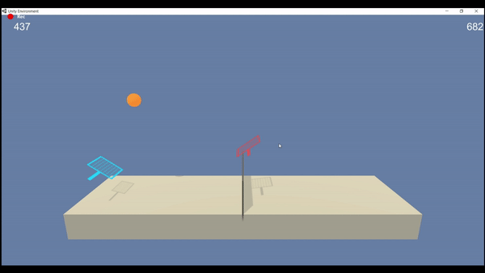

[]( https://www.youtube.com/watch?v=m2A0DGzOuro)

# DRL - Multi-Agent DDPG Algorithm - Tennis Collaboration

### Introduction 

In this environment, two agents control rackets to bounce a ball over a net. If an agent hits the ball over the net, it receives a reward of +0.1. If an agent lets a ball hit the ground or hits the ball out of bounds, it receives a reward of -0.01. Thus, the goal of each agent is to keep the ball in play.

The observation space consists of 24 variables corresponding to the position and velocity of the ball and racket. Each agent receives its own, local observation. 

Two continuous actions are available, corresponding to movement toward (or away from) the net, and jumping.

Using the Unity agent/environment "Tennis", this deep reinforcement learning task trains two AI agents to play tennis with each other in a cooperative way. The agents are rewarded for keeping the ball in play as long as possible. The task is considered solved when the average reward of the winning agent each episode hits 0.5 over 100 consecutive episodes.

The agents receive feedback in the form of a reward after taking each action. They decide whether to move their rackets forward or backward and at what velocity. They also can decide to jump. A +0.1 reward is given if the agent hits the ball over the net and a -0.01 penalty if they miss the ball or hit it out of bounds. The algorithm provides to each agent the velocity and position of both agents and the ball, but only tells each agent their own reward, not the reward of the other agent.

## MADDPG Algorithm

As seen in the code, the MADDPG algorithm is used to train the two agents. MADDPG is a multi-agent variant of DDPG, a model-free, off-policy (which means we can use Experience Replay), policy gradient-based algorithm that uses two separate deep neural networks (one actor, one critic).

The attached code written in Python, using PyTorch and presented in a Jupyter Notebook, demonstrates how the agents learn and eventually achieve the average score of 0.5 in 384 episodes. The attached <a href="Report.md">Report</a> describes the algorithm and methodology in detail, including the introduction of Exploratory Boost.

## Setup Instructions

To reproduce this model on a Mac:

1. Install the <a href="https://www.anaconda.com/download/#macos">Anaconda distribution of Python 3</a>

2. Install PyTorch, Jupyter Notebook and Numpy in the Python3 environment.
3.  to install the required components please run the below command.
   ```
   pip install -r requirements.txt
   ```

4. Clone the <a href="https://github.com/udacity/deep-reinforcement-learning">Udacity DRLND repo</a> and install the dependencies by typing the following:

    git clone https://github.com/udacity/deep-reinforcement-learning.git

    cd deep-reinforcement-learning/python

    pip install .
    
5.  Download the environment from one of the links below.  You need only select the environment that matches your operating system:

  - Linux: [click here](https://s3-us-west-1.amazonaws.com/udacity-drlnd/P2/Reacher/Reacher_Linux.zip)
  - Mac OSX: [click here](https://s3-us-west-1.amazonaws.com/udacity-drlnd/P2/Reacher/Reacher.app.zip)
  - Windows (32-bit): [click here](https://s3-us-west-1.amazonaws.com/udacity-drlnd/P2/Reacher/Reacher_Windows_x86.zip)
  - Windows (64-bit): [click here](https://s3-us-west-1.amazonaws.com/udacity-drlnd/P2/Reacher/Reacher_Windows_x86_64.zip)
    
    (_For Windows users_) Check out [this link](https://support.microsoft.com/en-us/help/827218/how-to-determine-whether-a-computer-is-running-a-32-bit-version-or-64) if you need help with determining if your computer is running a 32-bit version or 64-bit version of the Windows operating system.

4. Open Jupyter Notebook and run the Multiagent.ipynb file to train the agent. 

5. To watch the agents I trained play tennis, execute the following command
   ```
   python3 Testing.py
   ```


