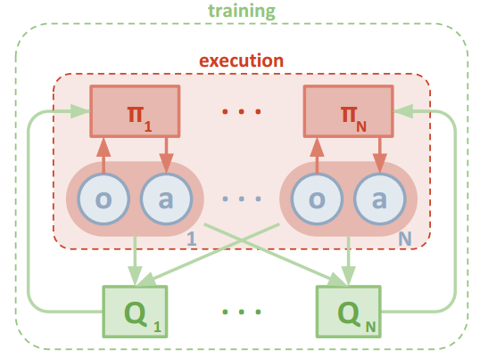
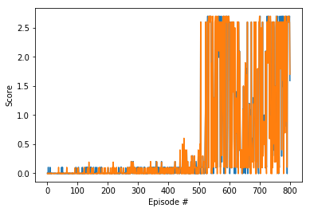
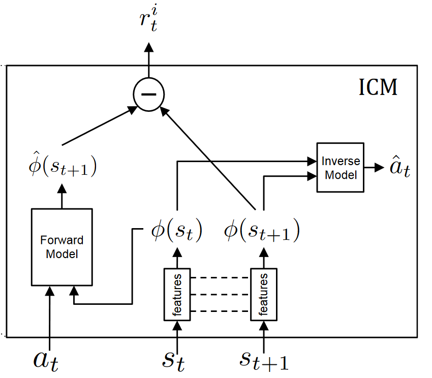

# DRL - Multi-Agent DDPG Algorithm - Tennis Collaboration

### Maddpg algorithm 
Simple RL algorithms mostly fail to solve multi-agent envs because as the policy changes in the training the env will be nonstationary in the perception of a single agent. this nonstationarity causes to violate the Markov assumptions, therefore, the convergence is not guaranteed.


```
P(s'|s, a, π1, ..., πN ) != P(s'|s, a, π1, ..., πN ) when any πi != π
```

To solve this, the maddpg algorithm was developed, which is actor-critic algorithm just like ddpg but the only difference is critic takes in input X which is a representation of states and action of all the agents at that time step. 

MADDPG has many advantages, some of them are,
1. We can use Experience Replay for training - sample efficient.
   
2. Centralized training and decentralized execution - so the action can be criticized based on an overall view, which gives us more freedom to design the behaviors. Since actors only require local observation, there is no need for any kind of communication between the agents while execution.
3. Markov assumptions are full-filled, as the following condition holds in MADDPG

```
P(s'|s, a1, ..., aN , π1, ..., πN ) = P(s'|s, a1, ..., aN ) = P(s'|s, a1, ..., aN , π1, ..., πN ) for any πi != π
```

for more info on MADDPG please read this <a href = "https://arxiv.org/abs/1706.02275"> paper </a>.
### Model Architecture

For this task, there are two agents each has observation state variables of 24 variables which have the position, velocity information of the agent and the ball.

the action that agents need to take is 2 variables of continuous space for vertical and horizontal motion with values from -1 to +1.

In MADDPG, each agent has an actor and critic of its own.

The actor will take in local observation/state as the input (24) and give the actions of max Q value has an output (2).
The critic will take input X (48) which describes the overall state of all the agents (here it's simply a concat of all agents observation) and actions taken by all the agents (4) will give one output which will be the Q-value (1) and will be used to train the actors based on policy gradient methods. 



The detailed architecture that has been used in this project is given below.
```

Actor-Network
----------------------------------------------------------------------------
        Layer (type)               Output Shape         Param #    Activation
============================================================================
            Linear-1                  [24, 256]           6,400     Relu
            Linear-2                  [256, 128]          32,896     Relu
            Linear-3                    [128, 2]             258     Tanh
============================================================================
Total params: 39,554
Trainable params: 39,554
Non-trainable params: 0
-----------------------------------------------------------------------------
the actor-network just takes the local states as the input that's why it's input consists of (24)
the tanh is used as the activation for the last layer because the action values are (-1,1)

Critic-Network

----------------------------------------------------------------------------
        Layer (type)               Output Shape         Param #    Activation
============================================================================
            Linear-1                  [48, 256]           6,400     Relu
            Linear-2                  [256 + 4 , 128]     32,896    Relu
            Linear-3                    [128, 1]            `258    None
============================================================================
Total params: 39,554
Trainable params: 39,554
Non-trainable params: 0
-----------------------------------------------------------------------------
the critic-network requieres an overall state x that describes all the agent's states and action. here x in concat of all agents local observation. and both the agents action are fed into the 2nd hidden layer. critic network outputs one value which is used as a baseline for actor-net.


actor model has been used .. for agent number 0 Actor(
  (fc1): Linear(in_features=24, out_features=256, bias=True)
  (fc2): Linear(in_features=256, out_features=128, bias=True)
  (fc3): Linear(in_features=128, out_features=2, bias=True)
)
actor optim Adam (
Parameter Group 0
    amsgrad: False
    betas: (0.9, 0.999)
    eps: 1e-08
    lr: 0.0001
    weight_decay: 0
)
critic model which is used for agent number 0 Critic(
  (fcs1): Linear(in_features=48, out_features=256, bias=True)
  (fc2): Linear(in_features=260, out_features=128, bias=True)
  (fc3): Linear(in_features=128, out_features=1, bias=True)
)
critic optim Adam (
Parameter Group 0
    amsgrad: False
    betas: (0.9, 0.999)
    eps: 1e-08
    lr: 0.001
    weight_decay: 0.0
)
actor model been used .. for agent number 1 Actor(
  (fc1): Linear(in_features=24, out_features=256, bias=True)
  (fc2): Linear(in_features=256, out_features=128, bias=True)
  (fc3): Linear(in_features=128, out_features=2, bias=True)
)
actor optim Adam (
Parameter Group 0
    amsgrad: False
    betas: (0.9, 0.999)
    eps: 1e-08
    lr: 0.0001
    weight_decay: 0
)
critic model which is used for agent number 1 Critic(
  (fcs1): Linear(in_features=48, out_features=256, bias=True)
  (fc2): Linear(in_features=260, out_features=128, bias=True)
  (fc3): Linear(in_features=128, out_features=1, bias=True)
)
critic optim Adam (
Parameter Group 0
    amsgrad: False
    betas: (0.9, 0.999)
    eps: 1e-08
    lr: 0.001
    weight_decay: 0.0
)
```

### Hyperparameters
The hyperparameters that used in this project are given below.

1. BUFFER_SIZE = int(1e6) 
- The buffer size determines the size of the experience replay buffer. 
2. BATCH_SIZE = 128
- determines the size of the batch in stochastic gradient descent. 

3. GAMMA = 0.99
- the discount factor which determines how far future the agent supposed to look
  
4. TAU = 6e-2 
- for soft update of target parameters
5. Learning rate 
- LR_ACTOR = 1e-3   => learning rate of the actor 
- LR_CRITIC = 1e-3  => learning rate of the critic

5. WEIGHT_DECAY = 0.000 
- L2 weight decay

6. updating parameters frequency 
   - UpdateCount = 1 # after these no of times the update to the neural net takes place 
   - UpdateNo = 1 # no of updates per time

### Exploration
for exploration, I have implemented the OU noise which is recommended in the paper.
The noise has a very high amplitude in the start so that the agent explores a lot as in beginning agents policy. 

ADD_NOISE = True
NOISE_START = 6
NOISE_END = 0
NOISE_DECAY = 500


### Results and Future Work

Utilizing the MADDPG algorithm with the above hyperparameters the agents achieved the average score of 0.5 after 800 episodes and it seems to maintain it's high reward even after a long time of training after that shows that it's stable.

The agents take about 500 episodes to explore states and train, which could explain that low rewards and after 500th episode exploitation phase begins, the agents start to score high rewards continuously with some instability in between and reach an average score of 0.5 in the 800th episode.

#### scores plot of both agents




Even though agents managed to give some very good performances, we could also see agents are also failing some cases which show that they haven't learned to face the ball in all scenarios yet.
While repeated testing also showed that the agents might have developed looping behaviors where agents might do the same thing repeatedly and achieve very good rewards.

This might look good as they can achieve high rewards repeatedly but this also could be the reason why the agents are not able to face the ball in all scenarios.

To solve this, I am planning to implement the curiosity-driven intrinsic reward model where the agents will be rewarded for exploring the states where it spends less time.



I believe this intrinsic reward module along with already present extrinsic reward function will help to unlock new versatile behaviors in the agents.

for more info on the Curiosity Driven intrinsic reward module check out this <a href ="https://arxiv.org/pdf/1705.05363.pdf"> paper </a>


